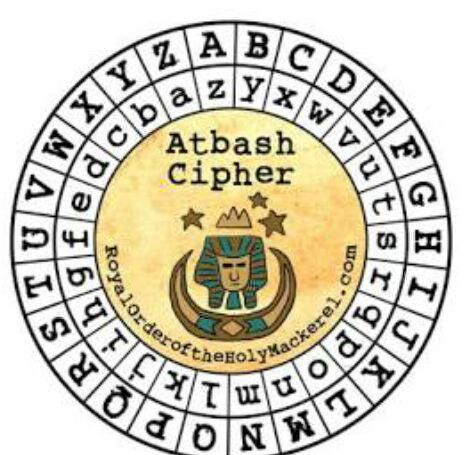
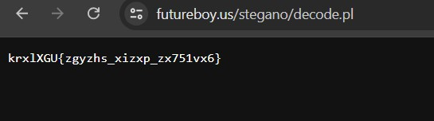
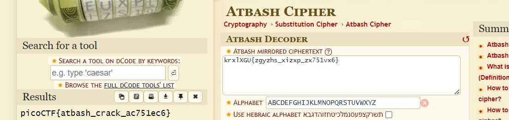

# HideToSee

# Description
How about some hide and seek heh?
Look at this image here.


# Hints
1. Download the image and try to extract it.

# What I Did
I Downloaded the file and based on the hint, i need to extract something from the image.
Before trying to extract it i try to find maybe i can find some information in the image,
I saw that there might be something i need to do with atbash cipher.



I tried to extract it using zip and binwalk but i got nothing.
Then i try to use Steghanography tools, and https://futureboy.us/stegano/decinput.html
this decoder works, i thought i need a password but i don't.
When i put the image in the decoder it shows me the encrypted flag.



Based on the context its an atbash cipher, i'm using this decoder
https://www.dcode.fr/atbash-cipher
It gives me the flag



the flag is

``` 

picoCTF{atbash_crack_ac751ec6}

```