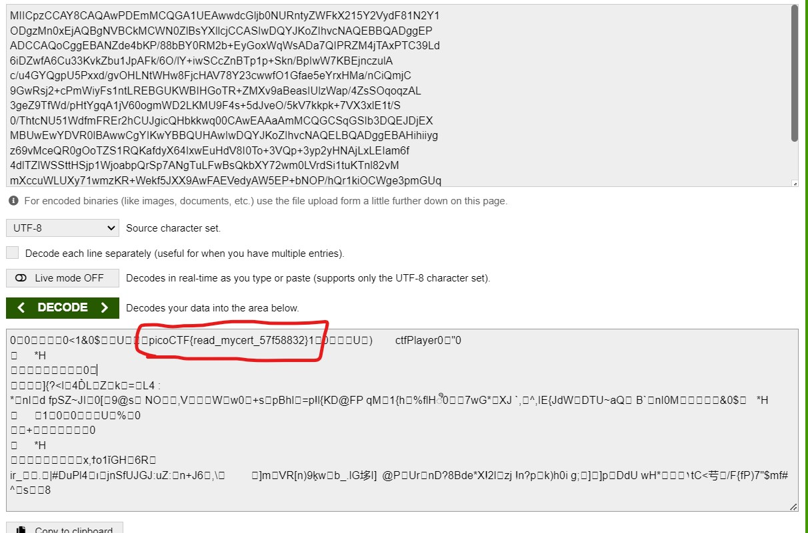

# ReadMyCert

# Description
How about we take you on an adventure on exploring certificate signing requests
Take a look at this CSR file here.


# Hints
1. Download the certificate signing request and try to read it.

# What I Did
After downloading the file i see that the file's certificate looks
like a base 64 since it has padding = at the end of the cipher text,
so i decode it in online base64 decoder.



as shown in the image above the flag is
``` 

picoCTF{read_mycert_57f58832}

```