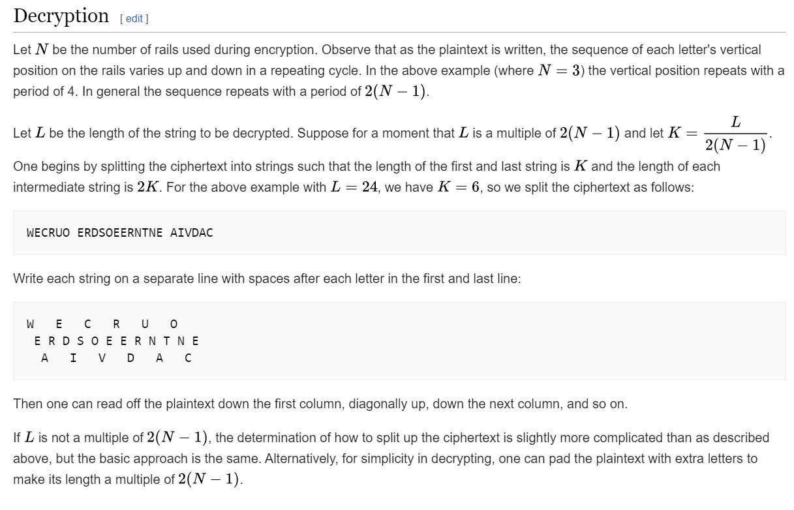

# rail-fence

# Description
A type of transposition cipher is the rail fence cipher, which is described here. Here is one such cipher encrypted using the rail fence with 4 rails. Can you decrypt it?
Download the message here.
Put the decoded message in the picoCTF flag format, picoCTF{decoded_message}.

# Hints
1. Once you've understood how the cipher works, it's best to draw it out yourself on paper

# What I Did
Based on the link given in the description https://en.wikipedia.org/wiki/Rail_fence_cipher
I need to count length of each intermediete string



Based on the formula since we have 4 rails we need to count the K value
we get 9.3333, so we need to make the rails 9 18 18 9. Since it's 9+
so the length of each rails won't be perfectly match 9 18 18 9.

This is what i get with some adjustment with the length of 10 19 18 9

```

rail_1 = "Ta _7N6D8D";
rail_2 = "hlg:W3D_H3C31N__387";
rail_3 = "ef sHR053F38N43DFD";
rail_4 = " i33___N6";

T.....a..... ....._.....7.....N.....6.....D.....8.....D...
.h...l.g...:.W...3.D..._.H...3.C...3.1...N._..._.3...8.7..
..e.f... .s...H.R...0.5...3.F...3.8...N.4...3.D...F.D.....
... .....i.....3.....3....._....._....._.....N.....6......

The flag is: WH3R3_D035_7H3_F3NC3_8361N_4ND_3ND_83F6D8D7


```

Based on the result the flag is
```

picoCTF{WH3R3_D035_7H3_F3NC3_8361N_4ND_3ND_83F6D8D7}

```