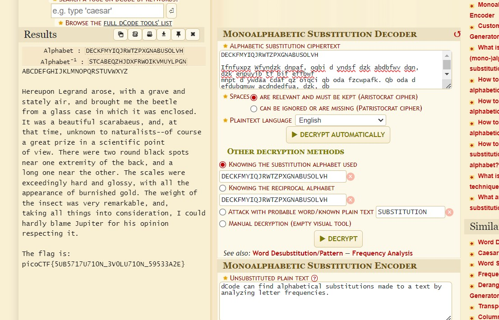

# substitution0

# Description
A message has come in but it seems to be all scrambled. Luckily it seems to have the key at the beginning. Can you crack this substitution cipher?
Download the message here.

# Hints
1. Try a frequency attack. An online tool might help.

# What I Did
Based on the description i tried all substitution cipher i found and turns out it is a 
monoalphabetic substitution. It works by changing every letter to the key given, so there
should be 26 length of key. In this case DECKFMYIQJRWTZPXGNABUSOLVH  is the key, so 
we change A -> D, B -> E, C -> C, etc.
I used this online decoder to get the flag.

https://www.dcode.fr/monoalphabetic-substitution



and the flag is

``` 

picoCTF{5UB5717U710N_3V0LU710N_59533A2E}

```