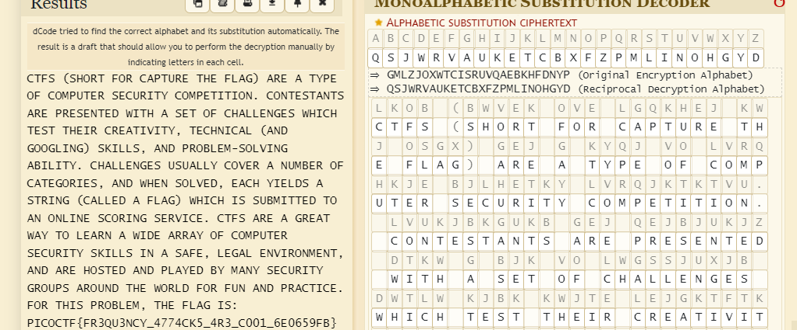

# substitution1

# Description
A second message has come in the mail, and it seems almost identical to the first one. Maybe the same thing will work again.
Download the message here.

# Hints
1. Try a frequency attack
2. Do the punctuation and the individual words help you make any substitutions?

# What I Did
Based on the hint and related ctf challenge before (substitution0), this challenge
is using monoalphabetic substitution, since the hint doesn't give me the decryption key.
I used auto decrypt in this link https://www.dcode.fr/monoalphabetic-substitution, where the
decryptor works by detecting english words(can be changed to other language if needed) the more the english
words detected in the decrypted text the better the result.

The automatic result is not 100% accurate so i need to adjust some of the key. In my case i read 
the whole decrypted text, and change the key if i see a word mispelled. 

by doing it i get this flag


the flag is
``` 

PICOCTF{FR3QU3NCY_4774CK5_4R3_C001_6E0659FB}

```