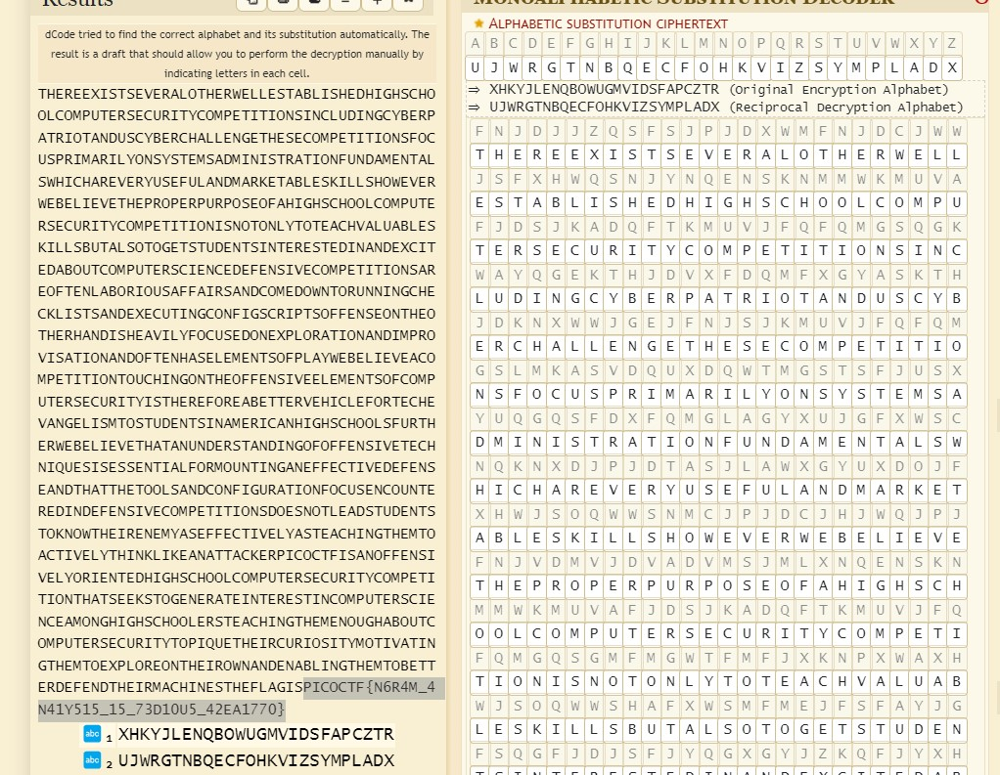

# substitution2

# Description
It seems that another encrypted message has been intercepted. The encryptor seems to have learned their lesson though and now there isn't any punctuation! Can you still crack the cipher?
Download the message here.

# Hints
1. Try refining your frequency attack, maybe analyzing groups of letters would improve your results?

# What I Did
This challenge is a continuation of substitution0 and substitution1 challenges. Based on the previous challenges
this is a monoalphabetic substitution challenge. I used this tool to decrypt the flag https://www.dcode.fr/monoalphabetic-substitution

So after i put the encrypted message in the tool, i did auto decrypt. After the decrypt done we still need to check if
the key is true or not by submitting the flag, if the flag get denied then we need to read each words in the
decrypted text to see if there is a mispelled word.

Then i get this result




the flag is
``` 

PICOCTF{N6R4M_4N41Y515_15_73D10U5_42EA1770}

```