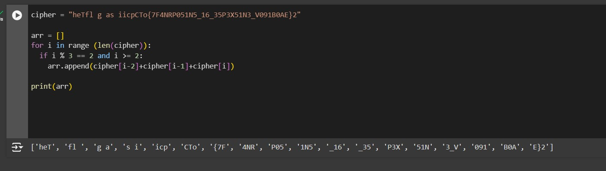
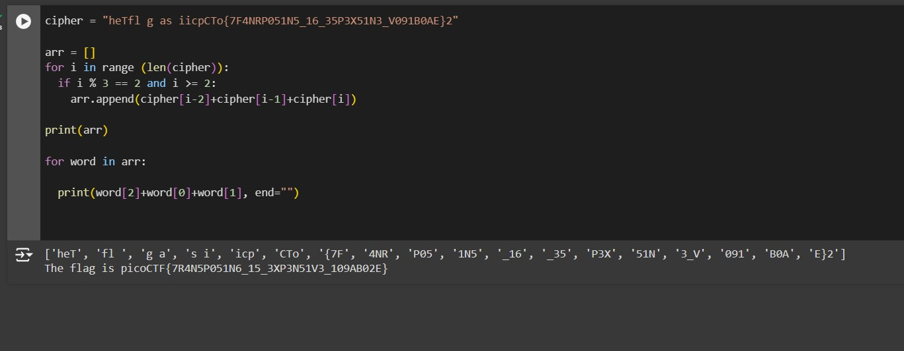

# transposition-trial

# Description
Our data got corrupted on the way here. Luckily, nothing got replaced, but every block of 3 got scrambled around! The first word seems to be three letters long, maybe you can use that to recover the rest of the message.
Download the corrupted message here.


# Hints
1. Split the message up into blocks of 3 and see how the first block is scrambled


# What I Did

Based on the description and hint, i create a python script to split the string into 3 letters each



Based on the result, i assume that in each 3 letters we need to move the third letter to be the first
letter in that specific word. For example heT becomes The because the T moved from the third
letter to the first letter. 
I create additional script to print the real flag


the flag is

``` 

picoCTF{7R4N5P051N6_15_3XP3N51V3_109AB02E}

```