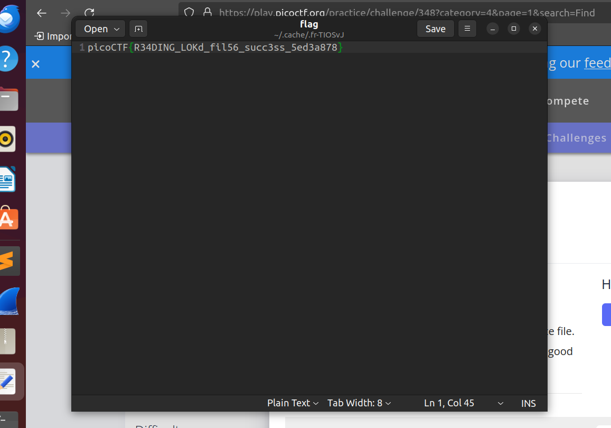

# FindAndOpen

Someone might have hidden the password in the trace file. Find the key to unlock this file. This tracefile might be good to analyze.

# Hints

1. Download the pcap and look for the password or flag.
2. Don't try to use a password cracking tool, there are easier ways here.

# What I Did

I downloaded both of the files, so basically in this question we need to know
what is the password used to zip the flag. So i checked the pcap file
to find for something useful

This is all information available in the pcap files. For the encoded base64
we need to give additional letters in the beginning of the string.


<ul>

<li>

```
Flying on Ethernet secret: Is this the flag
```

</li>
<li>

```
iBwaWNvQ1RGe

changed to
aiBwaWNvQ1RGe

decoded using base64
j picoCTFx
```
</li>

<li>

```
AABBHHPJGTFRLKVG hpcyBpcyB0aGUgc2 VjcmV0OiBwaWNvQ1 RGe1IzNERJTkdfTE 9LZF8=

changed to
aaAABBHHPJGTFRLKVG hpcyBpcyB0aGUgc2 VjcmV0OiBwaWNvQ1 RGe1IzNERJTkdfTE 9LZF8=

decoded using base64
i ɔhis is the secret: picoCTF{R34DING_LOKd_
```
</li>
<li>

```
PBwaWUvQ1RGe 1 Maybe try checking the other file
```
</li>

</ul>
Thats all messages that sent through in the LAN. So based on the hints, the password should be
somewhere in the informations, if i get all the informations correctly.

After bunch of guessing the password, turns out that the password for unzip the file is 
```picoCTF{R34DING_LOKd_```
which i didn't realise that its actually mentioned in the informations.

After i unzipped the file i get the full flag


the flag is
```

picoCTF{R34DING_LOKd_fil56_succ3ss_5ed3a878}

```