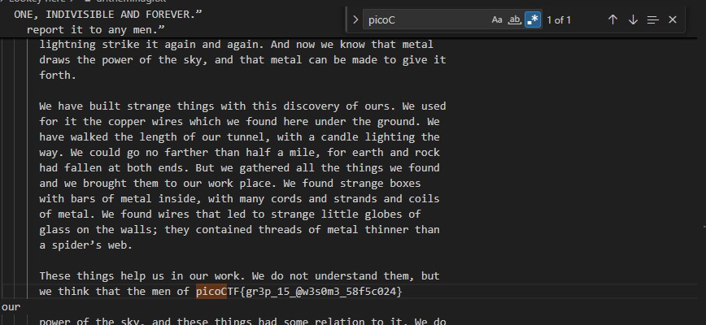

# Lookey here

Download the file and search for the flag based on the known prefix.

# Hints

1. How can you be sure of the redaction?

# What I Did

This challange should be solved using grep command, but since i am using
VSCode i just need to use find command to get the flag.



We can use this command if we want to grep it
`cat ./anthem.flag.txt | grep picoCTF`

The flag is

```

picoCTF{gr3p_15_@w3s0m3_58f5c024}

```
