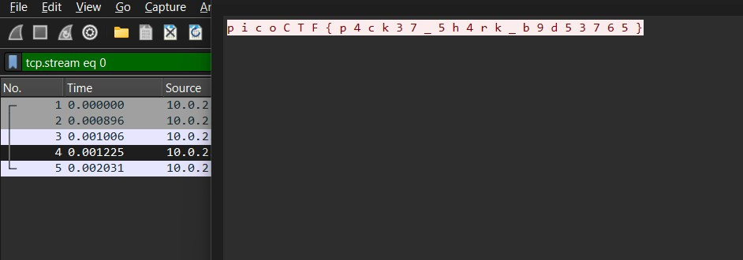

# Packets Primer

Download the packet capture file and use packet analysis software to find the flag.
Download packet capture

# Hints

1. Wireshark, if you can install and use it, is probably the most beginner friendly packet analysis software product.

# What I Did

I just need to open the pcap file in the Wireshark and the flag is in the 4th packet



the flag is

```

picoCTF{p4ck37_5h4rk_b9d53765}

```
