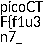

# Secret of the Polygot

The Network Operations Center (NOC) of your local institution picked up a suspicious file, they're getting conflicting information on what type of file it is. They've brought you in as an external expert to examine the file. Can you extract all the information from this strange file?
Download the suspicious file here.

# Hints

1. This problem can be solved by just opening the file in different ways

# What I Did
I downloaded the file and try to open it normally. Then i found a part of the flag


```1n_pn9_&_pdf_249d05c0}```

Then when i looked at the binary of the file in notepad, it shows me that the header is PNG


so i changed the extension to .png and i get the other part of the flag in an image 



```picoCTF{f1u3n7_```

By combining both of part of the flag i get the flag, 
and the flag is

``` 

picoCTF{f1u3n7_1n_pn9_&_pdf_249d05c0}

```