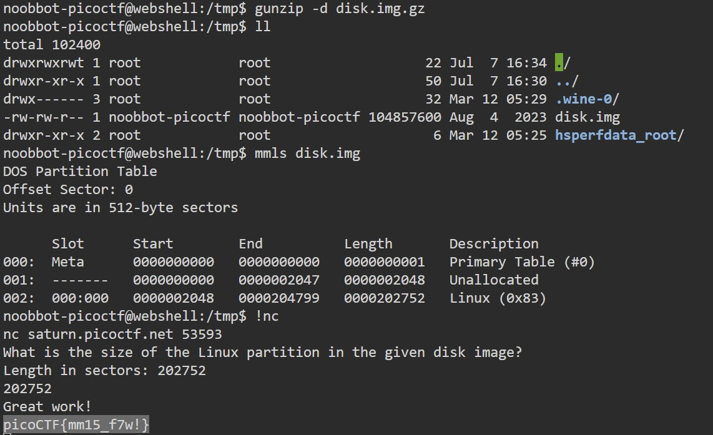

# Sleuthkit Intro

Download the disk image and use mmls on it to find the size of the Linux partition. Connect to the remote checker service to check your answer and get the flag.
Note: if you are using the webshell, download and extract the disk image into /tmp not your home directory.
Download disk image
Additional details will be available after launching your challenge instance.

# Hints

(None)

# What I Did
This challange is about disk analysis, so mmls command is used to see the partition
layout of a disk images(not same as png jpeg etc).

basically i just need to unzip the file in the challange and run mmls to it



the flag is
``` 

picoCTF{mm15_f7w!}

```