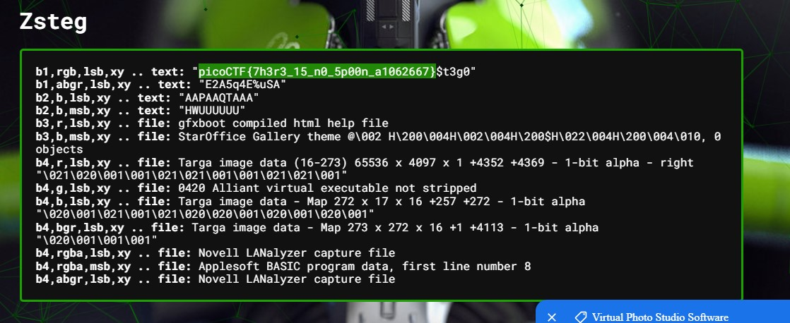

# St3g0

Download this image and find the flag.
Download image

# Hints

1. We know the end sequence of the message will be $t3g0.

# What I Did

I put the image in this tools
https://www.aperisolve.com/

in the Zsteg it shows me the flag.


The flag is basically hidden using LSB (Least Significant Bit)
Where it hid by the bit color

The flag is

```

picoCTF{7h3r3_15_n0_5p00n_a1062667}

```
