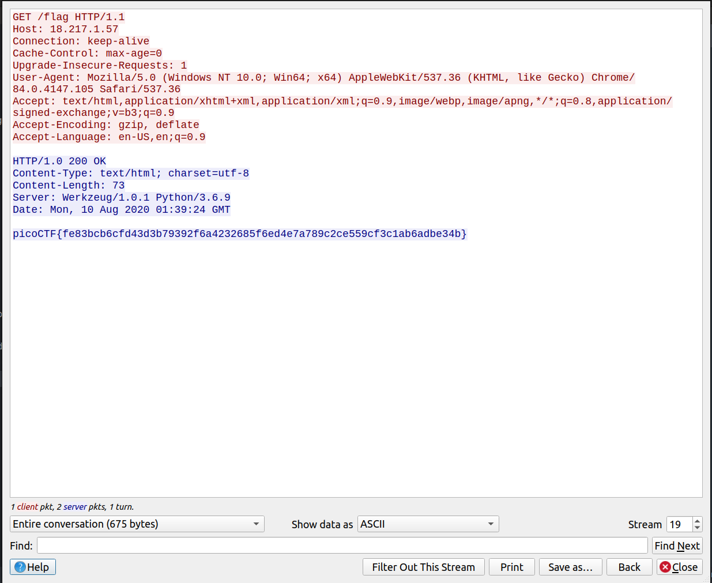
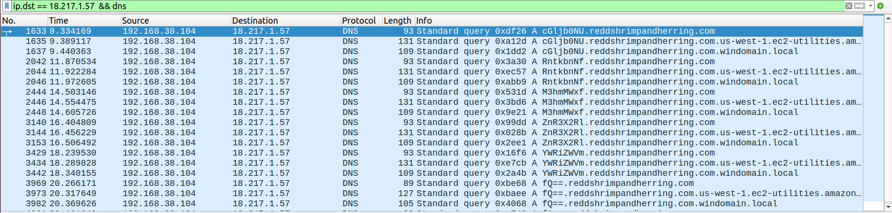
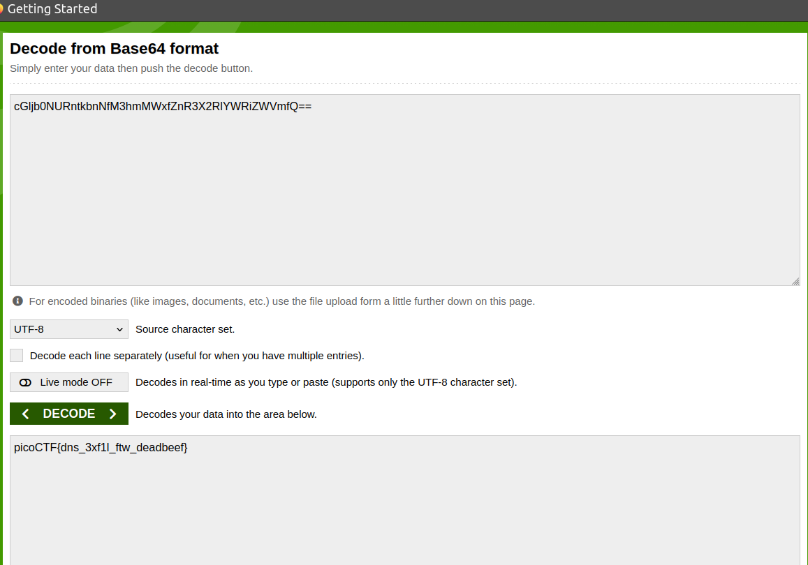

# Wireshark twoo twooo two twoo..

Can you find the flag? shark2.pcapng.

# Hints

1. Did you really find _the_ flag?
2. Look for traffic that seems suspicious.

# What I Did

After i downloaded the file, i open it in wireshark and looking for the
packets stream. After a while i see this stream that shows a flag



But when i submitted the flag, its actually a fake flag. At first i thought
i need to decrypt or do something with the flag, but there are actually a lot of
flags in another stream, then i tried to submit each one of the flag but returns empty.

Seeing the packet there are so many dns queries sent, and looking at the domain name address
they have weird subdomain for example o2ZJtOyF.reddshrimpandherring.com. This could
indicate that there might be a DNS Tunneling used here. In DNS Tunneling the
weird subdomain can be the data exfiltrated by attacker. 

So i checked every DNS subdomain till i found ```cGljb0NU.reddshrimpandherring.com```
in the stream 70 of DNS, where the subdomain is decodable using base64. 
When i decoded cGljb0NU it shows picoCT, so i think that the flag is near.

Since the first part of the flag sent to the ip of 18.217.1.57
so i filter the traffic to only shows the destination ip and
the dns traffic.



after assembling all the decoded subdomain i get this string
```
cGljb0NURntkbnNfM3hmMWxfZnR3X2RlYWRiZWVmfQ==
```
and when i decode it using base64 i get the flag



and the flag is
```

picoCTF{dns_3xf1l_ftw_deadbeef}

```