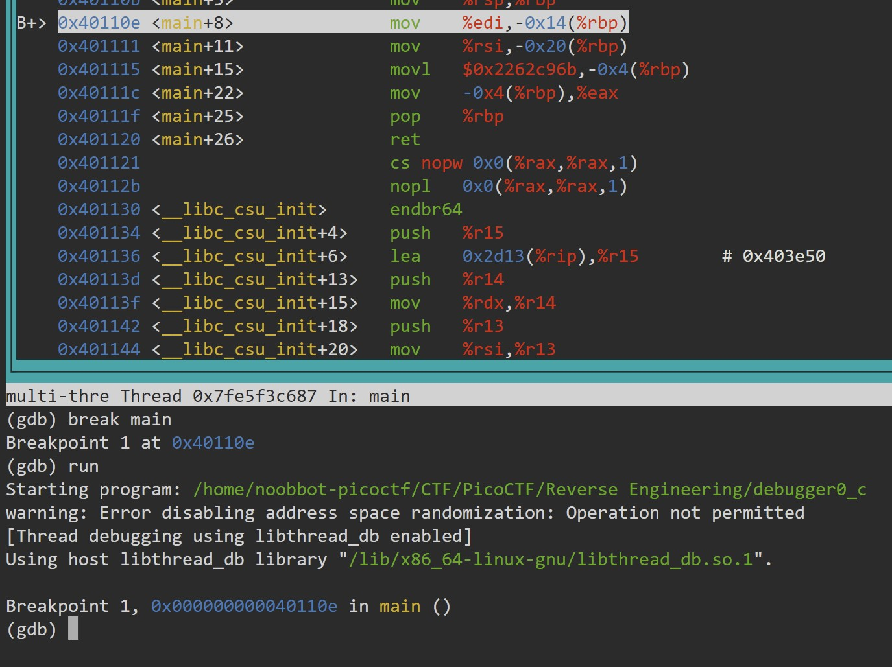
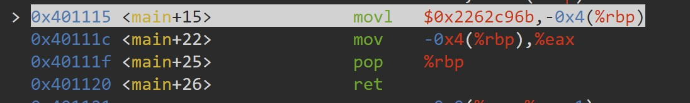
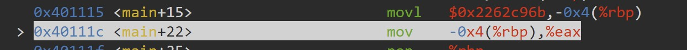
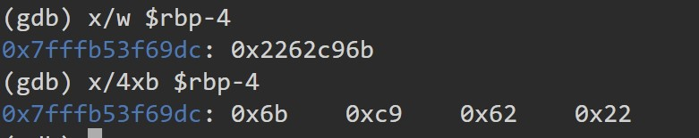

# GDB baby step 3

Now for something a little different. 0x2262c96b is loaded into memory in the main function. Examine byte-wise the memory that the constant is loaded in by using the GDB command x/4xb addr. The flag is the four bytes as they are stored in memory. If you find the bytes 0x11 0x22 0x33 0x44 in the memory location, your flag would be: picoCTF{0x11223344}.
Debug this.

# Hints

1. You'll need to breakpoint the instruction after the memory load.
2. Use the gdb command x/4xb addr with the memory location as the address addr to examine. GDB manual page.
3. Any registers in addr should be prepended with $ like $rbp.
4. Don't use square brackets for addr
5. What is endianness?

# What I Did

I used picoCTF terminal to solve this challange.
In this challange i need to know where is the constant value (0x2262c96b) is stored
in the memory, and examine the memory using x/4xb format.


On the description that the constant value stored in the main function so
i created a breakpoint in the main function, and run the program (make sure it has the permission to run chmod +x)


The constant value is stored in the -0x4(%rbp).
-0x4(%rbp) means 4 memory address below rbp address.

Since we already know where the constant value is stored, we just
need to examine the data using 4xb format.
This is the command to examine the data of rbp address -4
`x/4xb $rbp-4`

Before i do the command
i need to run the movl command (main+15) in the assembly using nexti to make the
constant value stored.



The value shown is 0x6b 0xc9 0x62 0x22

Based on the format given, so the flag is

```

picoCTF{0x6bc96222}

```
