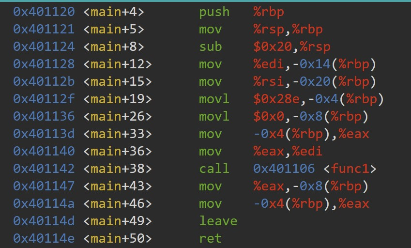
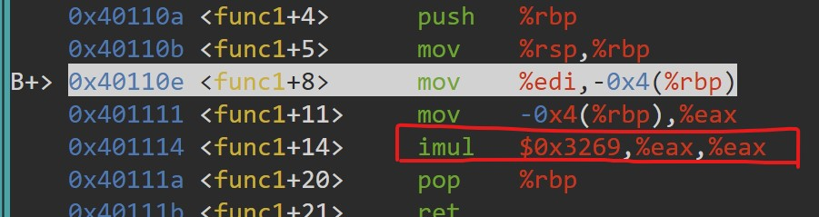
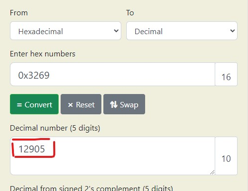

# GDB baby step 4

main calls a function that multiplies eax by a constant. The flag for this challenge is that constant in decimal base. If the constant you find is 0x1000, the flag will be picoCTF{4096}.
Debug this.

# Hints

1. A function can be referenced by either its name or its starting address in gdb.

# What I Did

I open `lay next` and create a breakpoint in the main function.
Look at the main assembly, there is a function called with the name of func1.



I create another breakpoint in the func1, and i see the constant value
that multiply the eax.



Then i put the hexadecimal in this converter and get the value.



its 12905
so the flag is

```

picoCTF{12905}

```
