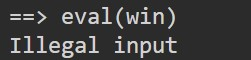
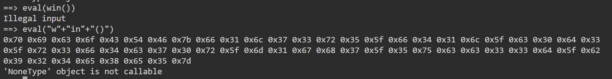
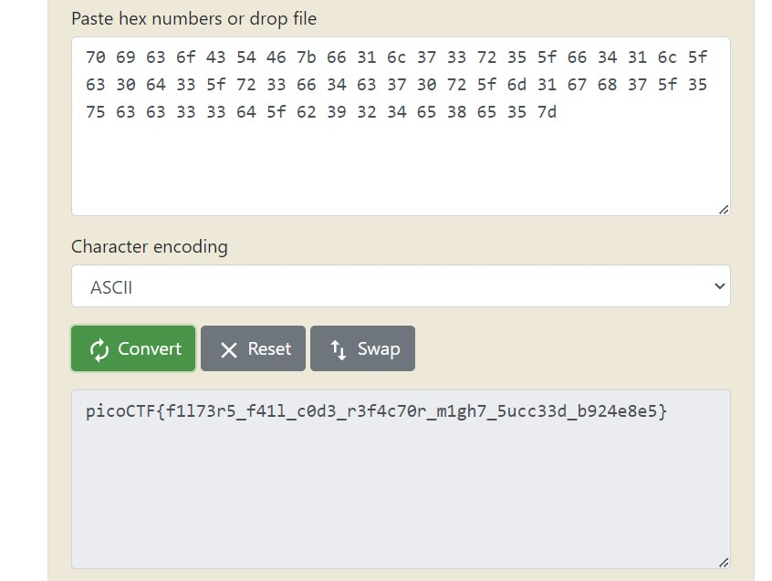

# Picker II

Can you figure out how this program works to get the flag?
Connect to the program with netcat:
nc saturn.picoctf.net 56501
The program's source code can be downloaded here.

# Hints

1. Can you do what win does with your input to the program?

# What I Did

I download the file and tried the program in the link.


I learn that the program works by, asking user for input, filter the input and run the input as a function.
So to run the win function i need to input win, but since the word win is filtered
so i need to figure out how to bypass it. I do a lot of trial and errors
until i get an idea where i need to concat the string like "w" + "in",
so the filter is not detecting any "win" string.


It gives me hexadecimal values

```
0x70 0x69 0x63 0x6f 0x43 0x54 0x46 0x7b 0x66 0x31 0x6c 0x37 0x33 0x72 0x35 0x5f 0x66 0x34 0x31 0x6c 0x5f 0x63 0x30 0x64 0x33 0x5f 0x72 0x33 0x66 0x34 0x63 0x37 0x30 0x72 0x5f 0x6d 0x31 0x67 0x68 0x37 0x5f 0x35 0x75 0x63 0x63 0x33 0x33 0x64 0x5f 0x62 0x39 0x32 0x34 0x65 0x38 0x65 0x35 0x7d
```

So i put it in online converter


and i get the flag, the flag is

```

picoCTF{f1l73r5_f41l_c0d3_r3f4c70r_m1gh7_5ucc33d_b924e8e5}

```
