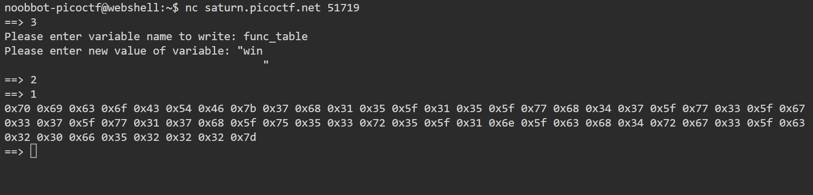
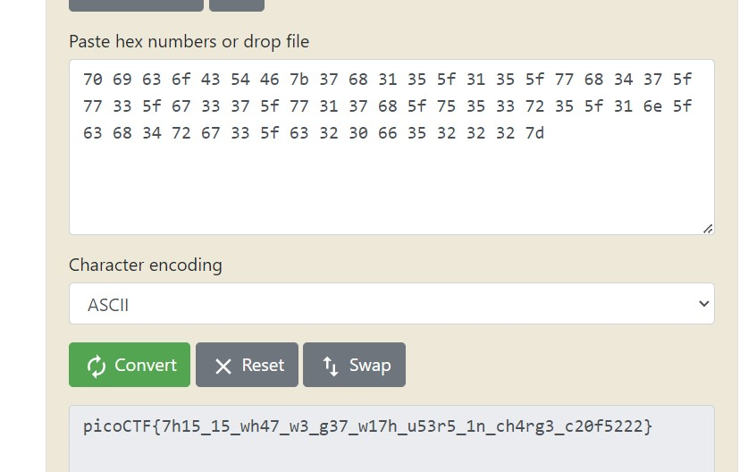

# Picker III

Can you figure out how this program works to get the flag?
Connect to the program with netcat:
nc saturn.picoctf.net 58596
The program's source code can be downloaded here.

# Hints

1. Is there any way to modify the function table?

# What I Did

I download the file and tried the program in the link.


So basically the programs works by, asking for the user to choose function number
from 1-4, after the user choose the function number the program call `call_func(n)` function,
then inside that function the program calls `check_table()` to validate if the variable func_table is corrupted or not by checking func_table's length. Then back to call_func it checks if the user input is
valid number or not then the program get the function name in the func_table variable and run it
using eval.

So based on how the code works we need to change the func_table so it contains `win()` function
in it. How to do it? we can use the on of the first 4 function given in the challange.

So i input 3 to write_variable, and i write (overwrite) func_table. To make sure that the program
not detecting that the func_table i make sure that the new func_table also have the same length
with the func_table before.
I used this code to check it.

```
func_table = \
'''\
print_table                     \
read_variable                   \
write_variable                  \
getRandomNumber                 \
'''


value = "win                                                                                                                             "
print(len(value))
print(len(func_table))
```

On that code above i put win function and give a lot of spaces till it reaches 128 length. Then i put it as
the new value of the func_table.

Then i run the win function by calling 1st function in the main program, So it takes the win function and run
it.


It showed me hexadecimal values

```
0x70 0x69 0x63 0x6f 0x43 0x54 0x46 0x7b 0x37 0x68 0x31 0x35 0x5f 0x31 0x35 0x5f 0x77 0x68 0x34 0x37 0x5f 0x77 0x33 0x5f 0x67 0x33 0x37 0x5f 0x77 0x31 0x37 0x68 0x5f 0x75 0x35 0x33 0x72 0x35 0x5f 0x31 0x6e 0x5f 0x63 0x68 0x34 0x72 0x67 0x33 0x5f 0x63 0x32 0x30 0x66 0x35 0x32 0x32 0x32 0x7d
```

I put it in hexadecimal to ascii converter and i get the flag


the flag is

```

picoCTF{7h15_15_wh47_w3_g37_w17h_u53r5_1n_ch4rg3_c20f5222}

```
