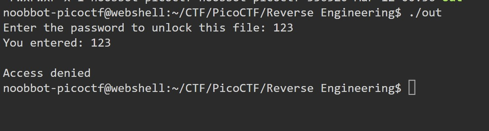
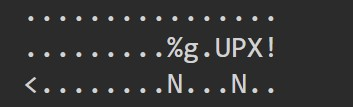
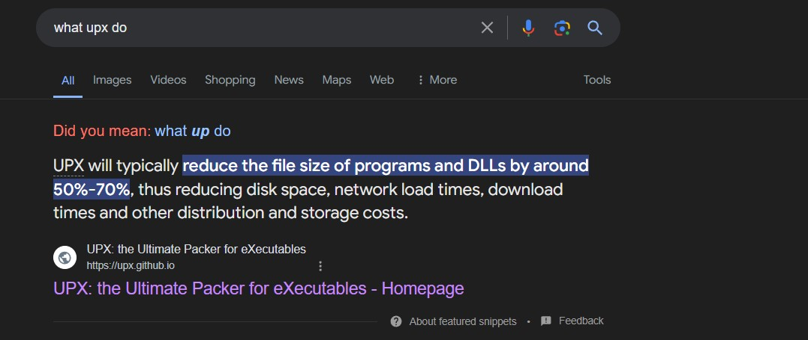
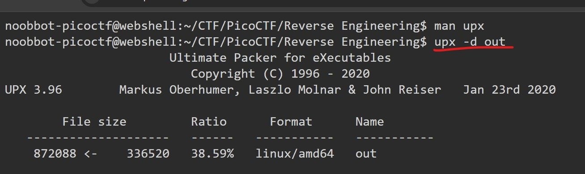
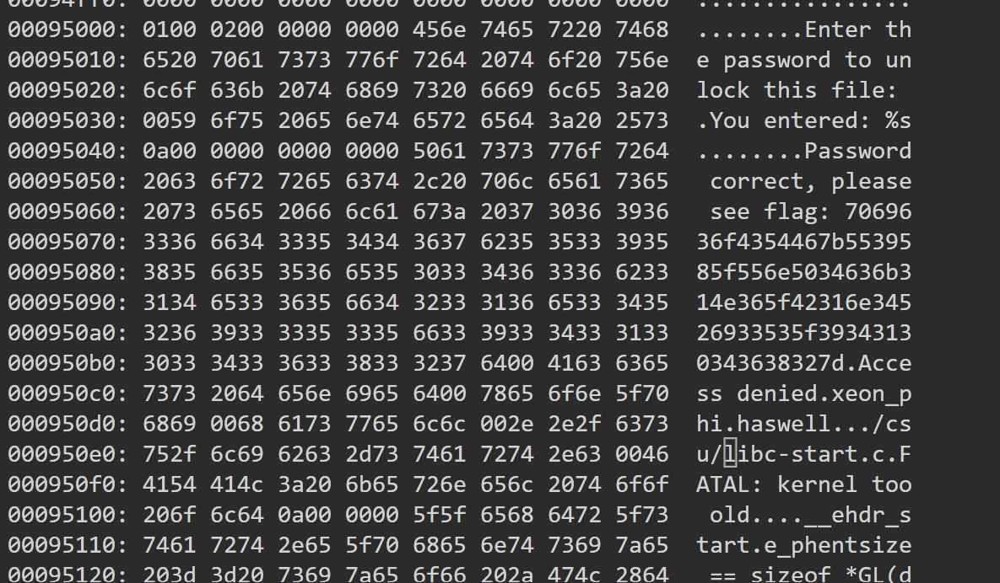
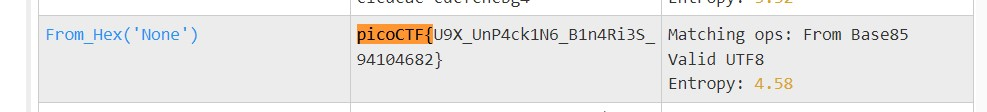

# packer

Reverse this linux executable?
binary

# Hints

1. What can we do to reduce the size of a binary after compiling it.

# What I Did

I downloaded it and run the file, and the program ask me for a password right after i run it
so i need to figure out a way to find the password.



Then i examined it in vim using xxd mode, and i try to google words in the file
until i find this UPX


When i googled about UPX it matches with the hint, so i dig deeper into it


UPX is basically a compressing tool, and to get the flag i need to decompress it
looking at this link (https://medium.com/@ankyrockstar26/unpacking-a-upx-malware-dca2cdd1a8de#:~:text=UPX%20Tool%3A%20The%20UPX%20tool,it%20to%20its%20original%20form.)
i decompressed the file


When i look at the file again in vim, i see that the flag is in a number format. I thought its the flag but its actually not
so i try to put it in cyberchef
see flag: 7069636f4354467b5539585f556e5034636b314e365f42316e34526933535f39343130343638327d


After i put it in cyberchef it shows me the flag.


and the flag is
```

picoCTF{U9X_UnP4ck1N6_B1n4Ri3S_94104682}

```