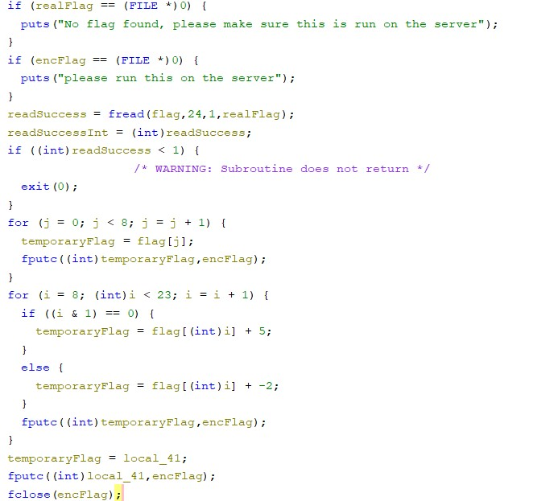
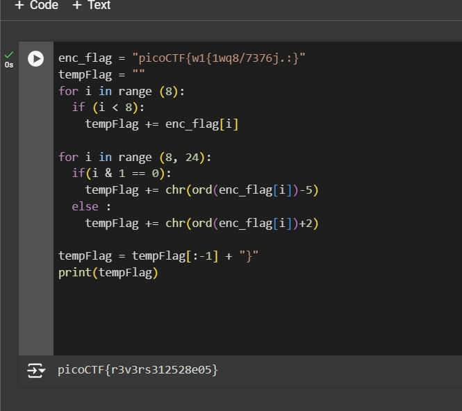

# reverse_cipher

We have recovered a binary and a text file. Can you reverse the flag.

# Hints

1. objdump and Gihdra are some tools that could assist with this

# What I Did

I downloaded both of the files, and based on what written in the file and the
hint, probably i need to turn the flag in rev_this back to the real flag, using 
algorithm that is stored in rev file. I use ghidra to
reverse the file.

After i open it in Ghidra i change some of the variables here is the result



The code is basically works by getting the real flag file from
the server and then it get the first 24 bytes, and check if the read
is success or not. 

This is the part where the encryption begin, it takes the first 8 bytes
which is the format of the flag 
```
PicoCTF{
```
and then it scrambling the rest
of the flag by checking if the binary of the i if &-ed by 1 (0001) is
equal to 0 or not, the example of the calculations is like this
```

1st Example
8 (1000)
AND
1 (0001)
========
0 (0000) == 0 TRUE

2nd Example
9 (1001)
AND
1 (0001)
========
1 (0001) != 0 FALSE

```
If the operation returns true it plus 5 the unicode of the selected letter
and if its not it decrease the unicoded value of the selected letter by 2.

To reverse it i just need to decrease by 5 if its true and plus 2 if its false.
I use python script to decrypt it (script.py).



and i get the flag the flag is

```

picoCTF{r3v3rs312528e05}

```
