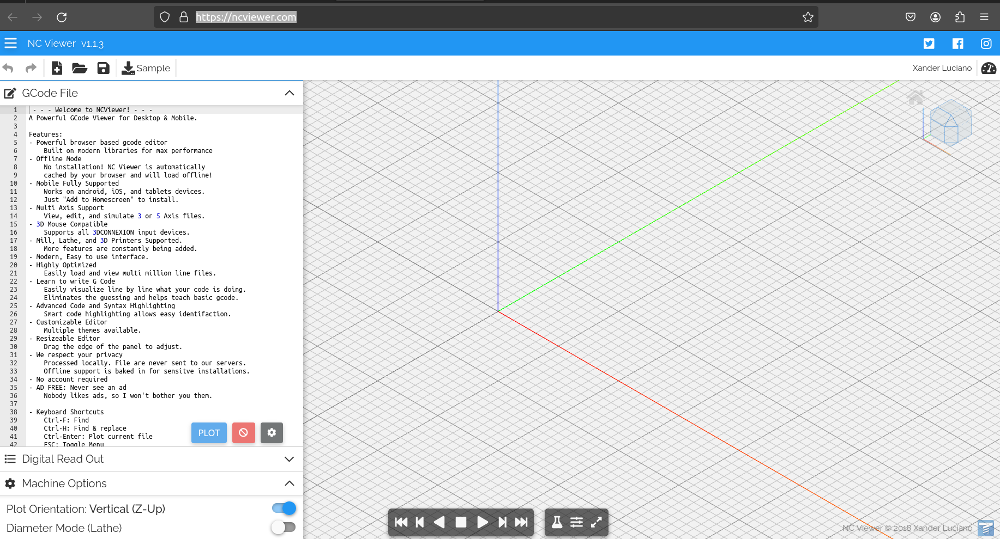
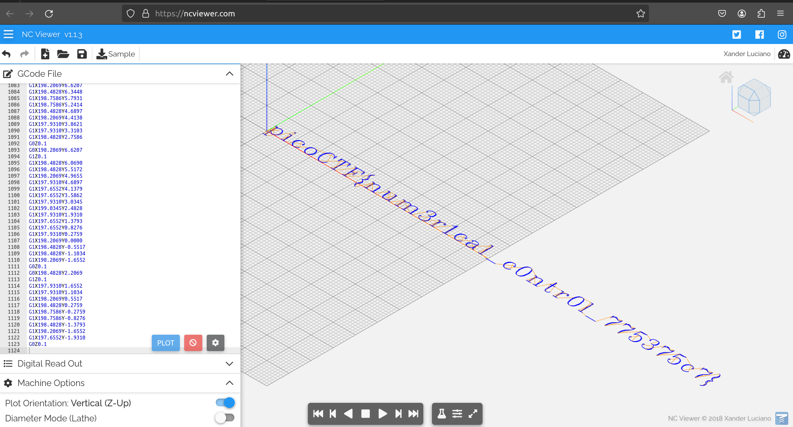

# speeds and feeds

There is something on my shop network running at nc mercury.picoctf.net 53740, but I can't tell what it is. Can you?

# Hints

1. What language does a CNC machine use?

# What I Did

I run the command in terminal, it prints
a lot of string that looks like a code. Based
on the hint, it tells us that it is a CNC machine language
so i google "CNC machine language". The language used called
G-Code. Then i google some words related to G-code
and then i find this drawer

```
https://ncviewer.com/
```


so i just need to copy all of the file in the nc link and then put it
in the G-ccode drawer. Since the output from nc is too much, i need to put it
in a file, the file is in "G-code" file in this folder.

It shows me the flag


and the flag is
```

picoCTF{num3r1cal_c0ntr0l_775375c7}

```