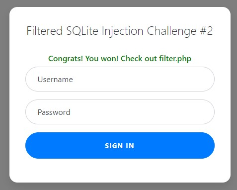
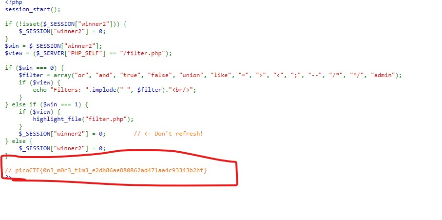

# Web Gauntlet 2

This website looks familiar... Log in as admin Site:

# Hints

1. I tried to make it a little bit less contrived since the mini competition.
2. Each filter is separated by a space. Spaces are not filtered.
3. There is only 1 round this time, when you beat it the flag will be in filter.php.
4. There is a length component now.
5. sqlite

# What I Did

This challange is about sql injection, and some words, and symbols are filtered.
`Filters: or and true false union like = > < ; -- /* */ admin`
So i cant type those in the input text directly.

I can't type admin in the input text, but i need to login as an admin,
This type of filter can be bypassed using concat, so i need to know how to,
use concat in the SQL language. I look at this
https://www.sqlitetutorial.net/sqlite-string-functions/

`SELECT username, password FROM users WHERE username='ad'||'min'' AND password=''`

On that payload i can get the username admin but now the problem is i cant use symbols to command out the
rest of the SQL code. So i look for another command in the website and i find substr method. After
some trial and errors i get this payload.

`SELECT username, password FROM users WHERE username='ad'||'mi'||substr(' AND password=',1,0) || 'n'`



It shows me the flag in the filter.php



The flag is

```

picoCTF{0n3_m0r3_t1m3_e2db86ae880862ad471aa4c93343b2bf}

```
